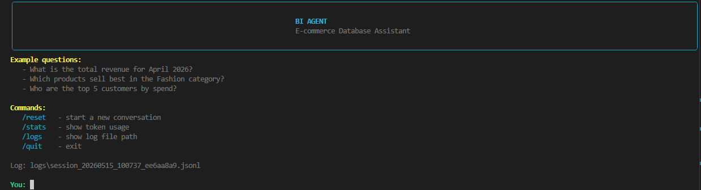

<p align="center">
  
</p>

# BI Agent — Battery Research Assistant

An LLM-powered CLI agent that answers research questions about Li-ion battery degradation. The agent automatically generates SQL queries against a real battery dataset, searches the web for external context when needed, and replies in clean, formatted Bahasa Indonesia.

Built on **MiniMax-M2.7** (OpenAI-compatible API) with a hybrid DB + web search strategy, SQL self-correction, and observability via JSONL logs.

---

## Features

- **Conversational battery research** — ask in natural language, get data-backed answers
- **Hybrid knowledge** — DB-first for internal data, web search (Tavily) for benchmarks, definitions, and external context
- **Tool-using agent** — LLM decides when to query SQL, explore column values, or search the web
- **Safe by design** — only `SELECT`/`WITH` allowed; dangerous keywords blacklisted; multi-statement blocked
- **Self-correcting** — query errors return a `hint` that the agent uses to fix and retry
- **Pretty CLI** — `rich`-based tables, syntax-highlighted SQL, web result panels, spinners, markdown rendering
- **Observability** — every session logged to JSONL

---

## Architecture

```
+----------+    user input    +----------+
| main.py  | ---------------> | agent.py |
|  (CLI)   | <--------------- |  (loop)  |
+----------+    rich output   +----+-----+
                                   |
                          tool_calls|
                                   v
                    +--------------+---------------+
                    |              |               |
               +----+----+   +----+----+   +-------+------+
               |tools.py |   |tools.py |   | tools.py     |
               |execute_ |   |get_     |   | web_search   |
               |sql      |   |distinct |   |              |
               +---------+   +---------+   +--------------+
                    |                            |
                    v                            v
             +-----------+              +----------------+
             |database.py|              | web_search.py  |
             | + SQLite  |              | (Tavily API)   |
             +-----------+              +----------------+
                    |
                    | log every event
                    v
               +---------+
               |logger.py| --> logs/*.jsonl
               +---------+
```

### File overview

| File | Purpose |
|---|---|
| `main.py` | CLI entry point + interactive chat loop |
| `agent.py` | Agent loop (call API → handle tool calls → loop until final answer) |
| `tools.py` | Tool schema & dispatcher (`execute_sql`, `get_distinct_values`, `web_search`) |
| `database.py` | SQLite connection, query validation, error hints, schema introspection |
| `web_search.py` | Tavily API integration for external web search |
| `load_battery_data.py` | ETL: load Kaggle CSV → `data/battery.db` |
| `quick_check.py` | Utility: explore raw CSV structure before running ETL |
| `ui.py` | Presentation module (rich-based) — panels, tables, spinners, markdown |
| `logger.py` | Per-session JSONL logger for observability |
| `data/battery.db` | SQLite database (generated by `load_battery_data.py`) |
| `data/raw/` | Raw CSV from Kaggle (gitignored) |
| `logs/` | Per-session log files |

---

## Database Schema

A single-table schema from a real Li-ion battery degradation dataset:

**`battery_cycles`** — one row per charge/discharge cycle per battery

| Column | Type | Unit | Description |
|---|---|---|---|
| `id` | INTEGER | — | Primary key (autoincrement) |
| `battery_id` | TEXT | — | Battery identifier (e.g. `B5`, `B6`) |
| `cycle` | INTEGER | — | Cycle number |
| `charge_current` | REAL | Ampere (A) | Current during charging |
| `charge_voltage` | REAL | Volt (V) | Voltage during charging |
| `charge_temperature` | REAL | °C | Temperature during charging |
| `discharge_current` | REAL | Ampere (A) | Current during discharging |
| `discharge_voltage` | REAL | Volt (V) | Voltage during discharging |
| `discharge_temperature` | REAL | °C | Temperature during discharging |
| `capacity` | REAL | Ah | Measured capacity this cycle |
| `soh` | REAL | % | State of Health |
| `rul` | INTEGER | cycles | Remaining Useful Life |

**Domain glossary:**
- **SOH** — State of Health: battery condition as % of nominal capacity
- **RUL** — Remaining Useful Life: cycles remaining before End of Life
- **EOL** — End of Life: conventionally SOH < 80%
- **Knee point** — cycle where degradation suddenly accelerates

---

## Setup

### 1. Prerequisites

- Python 3.11+
- MiniMax API key — [minimax.io](https://www.minimax.io/)
- *(Optional)* Tavily API key for web search — [tavily.com](https://tavily.com) (free tier: 1,000 searches/month)

### 2. Install dependencies

```powershell
py -m venv venv
.\venv\Scripts\Activate.ps1
pip install -r requirements.txt
```

Main dependencies:
- `openai>=1.50.0` — SDK for MiniMax (OpenAI-compatible endpoint)
- `python-dotenv>=1.0.0` — loads `.env` file
- `rich>=13.7.0` — pretty CLI output
- `pandas>=2.0.0` — CSV loading for ETL
- `tavily-python>=0.5.0` — web search (optional)

### 3. Configure `.env`

```env
MINIMAX_API_KEY=sk-your-key-here
TAVILY_API_KEY=tvly-xxxxx        # optional — enables web search
```

### 4. Download the dataset

Download the battery degradation dataset from Kaggle and place it at:

```
data/raw/Battery_dataset.csv
```

*(Optional)* Explore the CSV structure first:

```powershell
python quick_check.py
```

### 5. Load the database

```powershell
python load_battery_data.py
```

Output:
```
🔋 BATTERY DATA ETL
📂 Reading Battery_dataset.csv...
   ✅ Loaded X,XXX rows × 11 columns
🔍 Data quality checks:
   • Batteries: ['B5', 'B6', ...]
   • Cycles range: 1 – NNN
   • SOH range: XX.XX% – 100.00%
   • No duplicates on (battery_id, cycle)
💾 Writing to data/battery.db...
✅ ETL complete!
```

---

## Usage

Run the agent:

```powershell
python main.py
```

Then ask anything, for example:

- *Pada cycle berapa B5 mencapai EOL?*
- *Bandingkan degradation rate semua battery*
- *Apakah degradasi 0.12%/cycle itu normal untuk Li-ion?*
- *Berapa rata-rata charge temperature B6 setelah cycle 100?*
- *Apa itu knee point pada battery degradation?*

### CLI commands

| Command | Function |
|---|---|
| `/reset` | Start a new conversation (clears history) |
| `/stats` | Show token usage & message count |
| `/logs` | Show the current session's log file path |
| `/quit` or `/exit` | Exit |

---

## Hybrid Search Strategy

The agent has two knowledge sources and uses them based on the question type:

| Question type | Strategy |
|---|---|
| Data in our dataset (SOH, capacity, cycle, RUL, temperature) | `execute_sql` first |
| Values/column names unknown | `get_distinct_values` before filtering |
| External benchmarks, definitions, typical values, pricing | `web_search` |
| "Is our data normal?" / internal + external context needed | Both: SQL → web → combine |

When combining sources, the agent explicitly labels which data comes from our dataset vs. the web.

Web search is **optional** — if `TAVILY_API_KEY` is not set, the agent operates in DB-only mode and shows a status message on startup.

---

## Query Safety

The database tool is **read-only** with defense-in-depth:

1. **Whitelist** — only `SELECT` / `WITH` is allowed
2. **Blacklist** — keywords `INSERT`, `UPDATE`, `DELETE`, `DROP`, `ALTER`, `TRUNCATE`, `CREATE`, `REPLACE`, `ATTACH`, `DETACH`, `PRAGMA`, `VACUUM` are rejected
3. **No multi-statement** — `SELECT 1; SELECT 2` is rejected (regex that strips string literals first)
4. **Identifier validation** — table/column names in `get_distinct_values` are validated against `^[a-zA-Z_][a-zA-Z0-9_]*$`

---

## Observability

Every session is logged to `logs/session_<timestamp>_<id>.jsonl`. JSON Lines format — one event per line.

Logged events:
- `session_start` — when the agent is created
- `user_message` — message from the user
- `tool_call` — tool name + arguments + result preview (truncated to 500 chars)
- `assistant_message` — final answer + cumulative token usage
- `error` — API failure or iteration limit exceeded

Quick analysis with PowerShell:

```powershell
Get-Content logs\session_*.jsonl | ConvertFrom-Json | Where-Object event -eq 'tool_call'
```

---

## Agent Configuration

Key constants in `agent.py`:

| Constant | Default | Description |
|---|---|---|
| `MODEL_NAME` | `MiniMax-M2.7` | Model in use |
| `MAX_ITERATIONS` | `10` | Max agent loop iterations per question |
| `MAX_RETRIES` | `3` | API retries on transient errors |
| `INITIAL_BACKOFF` | `2` | Initial backoff seconds (exponential: 2, 4, 8) |

---

## UI Demo Without LLM

To test rich output without calling the API:

```powershell
python ui.py
```

---

## Troubleshooting

**`MINIMAX_API_KEY not found`**
→ Make sure `.env` exists in the project root and contains `MINIMAX_API_KEY=...`

**`Database tidak ditemukan di data/battery.db`**
→ Run `python load_battery_data.py` first

**`Battery_dataset.csv tidak ditemukan`**
→ Download the dataset from Kaggle and place it in `data/raw/`

**Web search always returns "TAVILY_API_KEY tidak ditemukan"**
→ Add `TAVILY_API_KEY=tvly-xxxxx` to `.env`. Sign up free at [tavily.com](https://tavily.com)

**Repeated `APIError` / `RateLimitError`**
→ Check API credit and internet connection. The agent retries 3× with exponential backoff

**Agent gives wrong queries / loop doesn't converge**
→ Open the latest log in `logs/`, check which `tool_call` errored and what hint was returned. Try `/reset` and rephrase the question

---

## Folder Structure

```
bi-agent/
+-- .env                    # API keys (gitignored)
+-- .gitignore
+-- README.md
+-- requirements.txt
+-- main.py                 # entry point
+-- agent.py                # agent loop
+-- tools.py                # tool definitions (SQL + web search)
+-- database.py             # SQLite ops + validation
+-- web_search.py           # Tavily web search integration
+-- load_battery_data.py    # ETL: CSV → battery.db
+-- quick_check.py          # utility: explore CSV structure
+-- ui.py                   # rich-based presentation
+-- logger.py               # JSONL session logger
+-- data/
|   +-- battery.db          # SQLite database (generated)
|   +-- raw/
|       +-- Battery_dataset.csv  # raw Kaggle dataset (gitignored)
+-- logs/
|   +-- session_*.jsonl
+-- venv/                   # virtual environment (gitignored)
```

---

## License

Not yet specified. Learning project.
